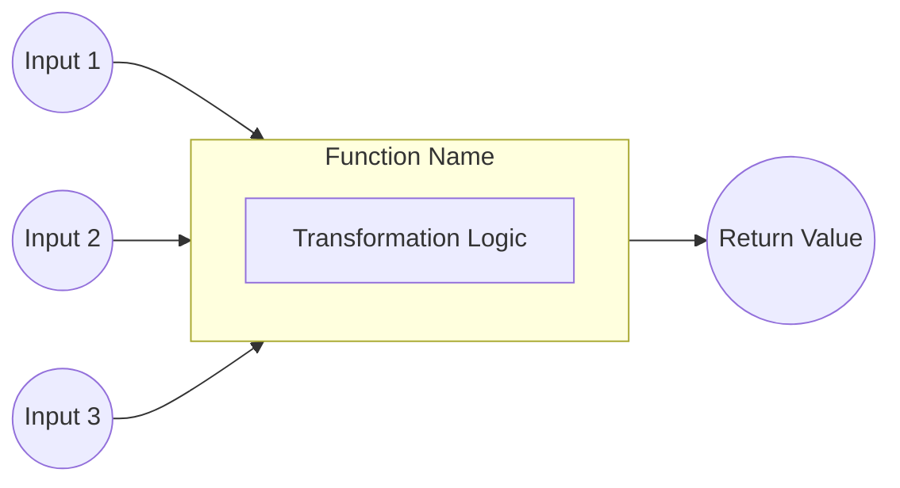
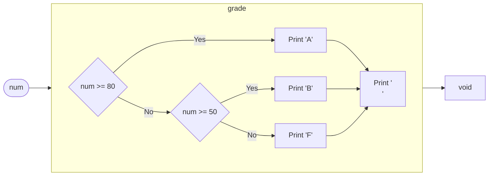
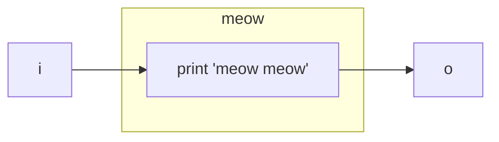
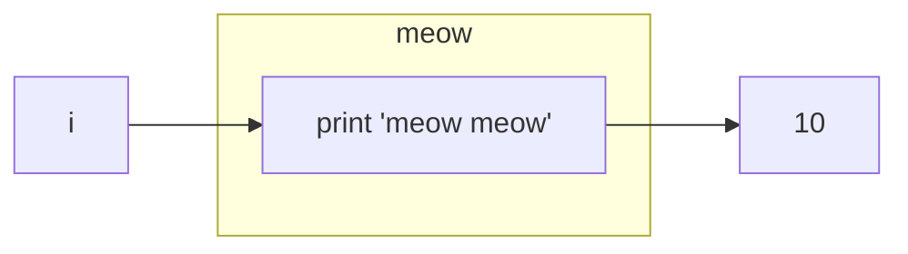
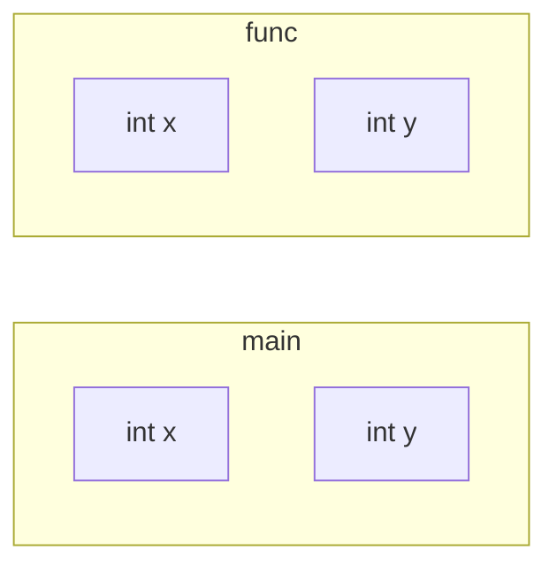
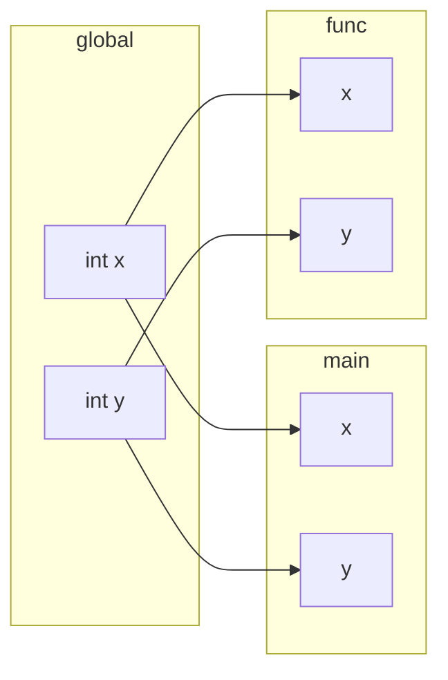
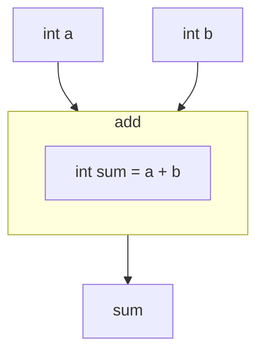

## C Programming

# Functions Basic

by Aurka CSE 15th

---
zoom: 1.25
---

<div class="grid grid-cols-1 grid-rows-1">
<div v-click-hide="2" class="col-start-1 row-start-1">

````md magic-move
```c
#include <stdio.h>

int main() {
    int mark;

    printf("Enter Mark: ");
    scanf("%d", &mark);

    if (mark >= 80) {
        printf("A");
    } else if (mark >= 50) {
        printf("B");
    } else {
        printf("F");
    }
    printf("\n");

    return 0;
}
```

```c
#include <stdio.h>

int main() {
    int mark;

    {
        printf("Enter Mark: ");
        scanf("%d", &mark);

        if (mark >= 80) {
            printf("A");
        } else if (mark >= 50) {
            printf("B");
        } else {
            printf("F");
        }
        printf("\n");
    }

    return 0;
}
```
````

</div>
<div v-click="2" class="col-start-1 row-start-1">

```c {monaco}
#include <stdio.h>

int main() {
    int mark;

    {
        printf("Enter Mark: ");
        scanf("%d", &mark);

        if (mark >= 80) {
            printf("A");
        } else if (mark >= 50) {
            printf("B");
        } else {
            printf("F");
        }
        printf("\n");
    }

    return 0;
}
```

</div>
</div>

---
zoom: 1
---

<div class="grid grid-cols-1 grid-rows-1">
<div v-click-hide="2" class="col-start-1 row-start-1">

````md magic-move {maxHeight:'100px'}
```c
#include <stdio.h>

int main() {
    int mark;

    {
        printf("Enter Mark: ");
        scanf("%d", &mark);

        if (mark >= 80) {
            printf("A");
        } else if (mark >= 50) {
            printf("B");
        } else {
            printf("F");
        }
        printf("\n");
    }

    return 0;
}
```

```c
#include <stdio.h>

int main() {
    int mark;
    for (int i = 0; i < 5; i++)
    {
        printf("Enter Mark: ");
        scanf("%d", &mark);

        if (mark >= 80) {
            printf("A");
        } else if (mark >= 50) {
            printf("B");
        } else {
            printf("F");
        }
        printf("\n");
    }

    return 0;
}
```
````

</div>
<div v-click="2" class="col-start-1 row-start-1">

```c {monaco-run}
#include <stdio.h>

int main() {
    int mark;
    for (int i = 0; i < 5; i++)
    {
        printf("Enter Mark: ");
        scanf("%d", &mark); // Input: 40 60 70 90 10

        if (mark >= 80) {
            printf("A");
        } else if (mark >= 50) {
            printf("B");
        } else {
            printf("F");
        }
        printf("\n");
    }

    return 0;
}
```

</div>
</div>


---


````md magic-move
```c
#include <stdio.h>

int main() {
    int mark;
    for (int i = 0; i < 5; i++)
    {
        printf("Enter Mark: ");
        scanf("%d", &mark); // Input: 40 60 70 90 10

        if (mark >= 80) {
            printf("A");
        } else if (mark >= 50) {
            printf("B");
        } else {
            printf("F");
        }
        printf("\n");
    }

    return 0;
}
```

```c {*|5|5,10|5,10,20|*}
#include <stdio.h>

int main() {
    int mark;
    int sum = 0;
    for (int i = 0; i < 5; i++)
    {
        printf("Enter Mark: ");
        scanf("%d", &mark); // Input: 40 60 70 90 10
        sum = sum + mark;
        if (mark >= 80) {
            printf("A");
        } else if (mark >= 50) {
            printf("B");
        } else {
            printf("F");
        }
        printf("\n");
    }
    int avg = sum/5
    printf("avg: %d\n", avg);
    return 0;
}
```
````

---


```c {monaco-run}
#include <stdio.h>

int main() {
    int mark;
    int sum = 0;
    for (int i = 0; i < 5; i++)
    {
        printf("Enter Mark: ");
        scanf("%d", &mark); // Input: 40 60 70 90 10
        sum = sum + mark;
        if (mark >= 80) {
            printf("A");
        } else if (mark >= 50) {
            printf("B");
        } else {
            printf("F");
        }
        printf("\n");
    }
    int avg = sum/5;
    printf("avg: %d\n", avg);
    return 0;
}
```

---


<div class="grid grid-cols-1 grid-rows-1">
<div v-click-hide="1" class="col-start-1 row-start-1">

```c {11-18,23-30}{maxHeight:'450px'}
#include<stdio.h>

int main() {
    int mark;
    int sum = 0;
    for (int i = 0; i < 5; i++) {
        printf("Enter Mark: ");
        scanf("%d", &mark);
        sum = sum + mark;

        if (num >= 80) {
            printf("A");
        } else if (num >= 50) {
            printf("B");
        } else {
            printf("F");
        }
        printf("\n");
    }
    printf("\navg: %d\n", sum / 5);
    int avg = sum / 5;

    if (num >= 80) {
        printf("A");
    } else if (num >= 50) {
        printf("B");
    } else {
        printf("F");
    }
    printf("\n");
    return 0;
}
```

</div>
<div v-click="1" class="col-start-1 row-start-1">

```c {*|4-11|3,12|22,27|*} {maxHeight:'450px'}
#include <stdio.h>

void grade(int num) {
    if (num >= 80) {
        printf("A");
    } else if (num >= 50) {
        printf("B");
    } else {
        printf("F");
    }
    printf("\n");
}

int main() {
    int mark;
    int sum = 0;
    for (int i = 0; i < 5; i++) {
        printf("Enter Mark: ");
        scanf("%d", &mark);
        sum = sum + mark;

        grade(mark);
    }
    printf("\navg: %d\n", sum / 5);
    int avg = sum / 5;

    grade(avg);
    return 0;
}
```

</div>
</div>

---



---



---
zoom: 1.25
---


```c {monaco-run}
#include<stdio.h>

void meow(){
    printf("meow meow\n");
}

int main(){
    meow();
}
```

---
zoom: 1.5
---



```c {monaco-run} {autorun:false}
#include<stdio.h>

int meow(){
    printf("meow meow\n");
    return 10;
}

int main(){
    printf("%d\n", meow());
}
```

---
zoom: 1.5
layout: two-cols
---

## Local Variable


::right::
```c {monaco-run}
#include<stdio.h>

void func(){
    int x;
    int y;
    printf("%d, %d\n", x, y);
}

int main(){
    int x;
    int y;
    printf("%d, %d\n", x, y);
}
```

---
layout: two-cols
zoom: 1.5
---

## global variable



::right::

```c {monaco-run}
#include<stdio.h>
int x;

void func(){
    printf("%d\n", x);
}

void main(){
    printf("%d\n", x);
}
```

---
layout: two-cols
zoom: 1.5
---

## parameters


::right::
```c {monaco-run} {autorun:false}
#include<stdio.h>
int add(int a, int b){
    int sum = a + b;
    return sum;
}

int main(){
    printf("%d\n", add(4, 5));
}
```

---

## math

$$
f(x,y) = 3x + 4y
$$

<v-click>

function name: `f`
</v-click>

<v-click>

parameters: `x`, `y`
</v-click>

<v-click>

function body: `3x + 4y`
</v-click>

<v-click>
$$
f(x) =
\begin{cases}
3 & ;x > 50 \\
-3 & ;x < 50
\end{cases}
$$
</v-click>

---
zoom: 1.4
---

## math to code

$$
f(x) =
\begin{cases}
3 & ;x > 50 \\
-3 & ;x < 50
\end{cases}
$$
<div class="grid grid-cols-1 grid-rows-1">
<div v-click=0 class="col-start-1 row-start-1">

````md magic-move
```c

```

```c
f(x):
    if x > 50 then return 3
    if x < 50 then return -3
```

```c
int f(int x){
    if (x > 50) return 3;
    else if (x < 50) return -3;
}
```

```c
#include<stdio.h>
int f(int x){
    if (x > 50) return 3;
    else if (x < 50) return -3;
}

int main(){
    printf("%d\n", f(10));
}
```
````

</div>
<div v-click="4" class="col-start-1 row-start-1">

```c {monaco-run}
#include<stdio.h>
int f(int x){
    if (x > 50) return 3;
    else if (x < 50) return -3;
}

int main(){
    printf("%d\n", f(10));
}
```

</div>
</div>

---
zoom: 1.4
---

practice? task?
1. all previous tasks with functions, with return type.
3. try to learn recursion
