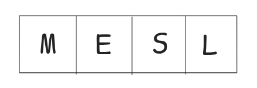
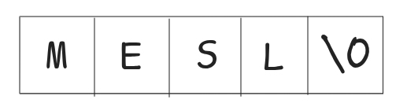

---
# try also 'default' to start simple
theme: seriph
# random image from a curated Unsplash collection by Anthony
# like them? see https://unsplash.com/collections/94734566/slidev
background: assets/guitar-string-order-2.jpg
# some information about your slides (markdown enabled)
title: Strings
info: |
  ## Slidev Starter Template
  Presentation slides for developers.

  Learn more at [Sli.dev](https://sli.dev)
# apply UnoCSS classes to the current slide
class: text-center
# https://sli.dev/features/drawing
drawings:
  persist: false
# slide transition: https://sli.dev/guide/animations.html#slide-transitions
transition: slide-left
# enable MDC Syntax: https://sli.dev/features/mdc
mdc: true
# duration of the presentation
duration: 35min
---

# Strings

---
transition: fade
---

## Definition
<br>
<v-click>
A string is an array of characters terminated by a special character '\0' (null character).
</v-click>

<br>
<v-click>

</v-click>

<br>
<v-click>

</v-click>

---
transition: slide-left
---

## Initialization
<br> 
``` c
char name[] = "MESL";
```
<br>
<v-click>

</v-click>
<br>
<v-click>
<div class = "text-center">
<h3> Format Specifier: %s </h3>
</div>
</v-click>

--- 
transition: fade-out
---

## Print it
<br> 
````md magic-move
```c
#include <stdio.h>
int main() {}
```
```c
#include <stdio.h>
int main() {
  char name[] = "MESL";
}
```
```c
#include <stdio.h>
int main() {
  char name[] = "MESL";
  printf("Output: %s",name);
}
```
````

---
transition: slide-up
---

## Access
<br>
````md magic-move
```c
#include <stdio.h>
int main() {}
```
```c
#include <stdio.h>
int main() {
  char name[] = "MESL";
}
```
```c
#include <stdio.h>
int main() {
  char name[] = "MESL";
  printf("1st character: %c",name[0]);
}
```
````
<!-- Why %c?  cumulative characters in array = strings-->

---
transition: fade
---

## Modify
<br>
````md magic-move
```c
#include <stdio.h>
int main() {}
```
```c
#include <stdio.h>
int main() {
  char name[] = "MESL";
}
```
```c
#include <stdio.h>
int main() {
  char name[] = "MESL";
  name[3] = 'S';
}
```
```c
#include <stdio.h>
int main() {
  char name[] = "MESL";
  name[3] = 'S';
  printf("Output: %s",name);
}
```
````

---
transition: fade-up
---

## Functions
<br>
````md magic-move 
```c
# include <stdio.h>
int main () {}
```
```c
# include <stdio.h>
int main () {
  char season[] = "winter";
}
```
```c
# include <stdio.h>
int main () {
  char season[] = "winter";
  // length of string??
}
```
```c
# include <stdio.h>
#include <string.h>
int main () {
  char season[] = "winter";
  // length of string??
  printf("length= %d", strlen(season));
}
```
````

---
transition: slide-down
---

## Input

```c {all|4|5|all}
#include <stdio.h>
int main() {
  char name[10];
  scanf("%s",name);
  printf("%s",name);
}
```

---
transition: slide-up
---

## Input
<br>
Input with spaces
<br>
```c {all|4|all}
#include <stdio.h>
int main() {
  char name[30];
  scanf("%[^\n]s",name);
  printf("%s",name);
}
```

---
transition: fade-up
---

## Input 
<br>
Using fgets
<br>
```c {all|3|4|all}
#include <stdio.h>
int main() {
  char name[30];
  fgets(str, 30, stdin);
  printf("%s",name);
}
```

---
transition: fade
---

## Passing to functions

<br>
````md magic-move
```c 
#include <stdio.h>
int main() {
  char name[30] = "Fahim Hossain Abir";
}
```
```c 
#include <stdio.h>
void printString(char n[]) {}

int main() {
  char name[30] = "Fahim Hossain Abir";
}
```
```c 
#include <stdio.h>
void printString(char n[]) {
  printf("%s",n);
}

int main() {
  char name[30] = "Fahim Hossain Abir";
}
```
```c 
#include <stdio.h>
void printString(char n[]) {
  printf("%s",n);
}

int main() {
  char name[30] = "Fahim Hossain Abir";
  printString(name);
}
```
````

---
layout: center
transition: fade
---

##Tasks

1. Determine length of string without using builtin function
2. Are 'aabbaa' & 'aabaab' equal?